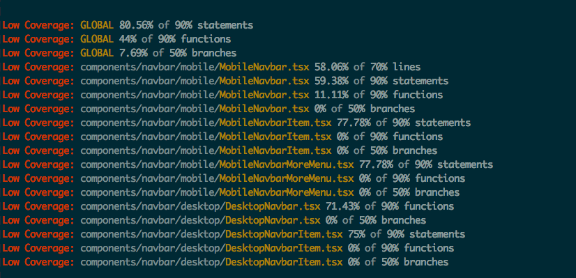

# karma-istanbul-threshold

[](https://travis-ci.org/titel-media/karma-istanbul-threshold)

Checks coverage thresholds by using json coverage files generated by
[Istanbul](https://github.com/gotwarlost/istanbul), 
[karma-coverage](https://github.com/karma-runner/karma-coverage) or
[karma-remap-istanbul](https://github.com/marcules/karma-remap-istanbul).

While [karma-coverage](https://github.com/karma-runner/karma-coverage) already allows
threshold checks, it unfortunately does not play well with source maps.

[karma-remap-istanbul](https://github.com/marcules/karma-remap-istanbul) can convert
results generated by [karma-coverage](https://github.com/karma-runner/karma-coverage)
but does not offer threshold checking.

This plugin fills that gap by using a json file for threshold checking that can be generated
by Istanbul or karma-coverage (which internally uses Istanbul). Those json files can be remapped
by karma-remap-istanbul to enable source-map support for threshold checking.
 



## Installation

The easiest way is to install `karma-istanbul-threshold` as a `devDependency`,
by running

```bash
npm install karma-istanbul-threshold --save-dev
```

## Configuration

Add the plugin, reporter and reporter configuration in your `karma.conf.js`.

```js
{
  plugins: ['karma-istanbul-threshold'],
  reporters: ['progress', 'karma-istanbul-threshold'],
  istanbulThresholdReporter: {
    src: 'path/to/coverage-report.json',
    basePath: path.resolve(__dirname, 'path/to/source'),
    reporters: ['teamcity'],
    thresholds: {
      global: {
        statements: 90,
        branches: 90,
        lines: 70,
        functions: 90,
      },
      each: {
        statements: 80,
        branches: 80,
        lines: 60,
        functions: 80,
      },
    },    
  }
}
```

### Example configuration with `karma-coverage` and `karma-remap-istanbul`
```js
{
  preprocessors: {
    'build/**/!(*spec).js': ['coverage']
  },
  plugins: ['karma-remap-istanbul', 'karma-coverage', 'karma-istanbul-threshold'],
  reporters: ['progress', 'coverage', 'karma-remap-istanbul', 'istanbul-threshold'],
  // Creates coverage reports and stores as json
  coverageReporter: {
    reporters: [
      { type: 'json', dir: 'tmp/coverage', subdir: '.', file: 'coverage-unmapped.json' }
    ],
  },
  // Creates a source-mapped version of coverage report  
  remapIstanbulReporter: {
    src: 'tmp/coverage/coverage-unmapped.json',
    reports: {
      'json': 'tmp/coverage/coverage-mapped.json'
    },
  },
  // Uses source-mapped version to check coverage thresholds
  istanbulThresholdReporter: {
    src: 'tmp/coverage/coverage-mapped.json',
    basePath: path.resolve(__dirname, 'path/to/source'),
    thresholds: {
      global: {
        statements: 90,
        branches: 90,
        lines: 70,
        functions: 90,
      },
      each: {
        statements: 80,
        branches: 80,
        lines: 60,
        functions: 80,
      },
    },    
  }
}
```
